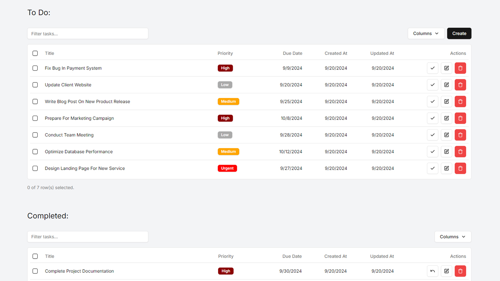

# Personal Task Manager (Solution) – Full Stack Engineer Code Challenge



## Overview

**Personal Task Manager** built using **Next.js 14+** and **TypeScript**, leveraging modern technologies such as **Drizzle ORM** for SQLite database management and **Tailwind CSS** for styling. The application allows users to manage tasks, providing features such as task creation, editing, and deletion. It also supports task prioritization, making it a robust tool for personal task management.

Key technologies used:

- **Next.js App Router**
- **SQLite with Drizzle ORM**
- **Tailwind CSS**
- **shadcn/ui** for pre-built components
- **TanStack Query** for efficient data fetching
- **Jest** for unit testing
- **ESLint** and **Husky** for code linting and pre-commit checks
- **Prettier** for code formatting

## Features

### 1. Task List Page (`/`)

- Displays a list of tasks using a server component.
- Each task shows its title, priority, due date, creation date and update date.
- Includes a button to add a new task (client component).
- Implements a refresh mechanism to update the task list.

### 2. Add Task Page (`/add`)

- Users can input the following:
  - **Task Title**
  - **Description**
  - **Priority**
  - **Due Date**
- Form submission is handled through server actions and mutations.
- Validates inputs before saving.
- Persists the task to the SQLite database via Drizzle ORM.

### 3. Task Detail Page (`/[id]`)

- Displays full details of the selected task using a server component.
- Provides options to **toggle status**, **edit** or **delete** the task using client components and server actions.

### 4. Edit Task Page (`/[id]/edit`)

- Allows users to modify task details.
- Updates the task in the local SQLite database using Drizzle ORM.

### Additional Features

1. **Task Prioritization**: Users can set priorities for tasks (Low, Medium, High, Urgent)
2. **Optimistic Updates**: Provides a smoother user experience by updating the UI optimistically.
3. **Efficient Data Fetching**: Utilizes **TanStack Query** for efficient data fetching, caching, optimistic updates, and cache invalidation.
4. **Unit Testing**: Added **Jest** unit tests for key components and server actions.
5. **Husky** Integration: Ensures pre-commit checks using ESLint.

## Installation & Setup

### Step 1: Clone the repository

```bash
git clone https://github.com/azuresphere7/blen-fullstack-engineer-take-home.git
cd blen-fullstack-engineer-take-home
```

### Step 2: Install dependencies

```bash
pnpm install
```

### Step 3: Run database migrations

```bash
pnpm migrate
# or
pnpm drizzle-kit migrate
```

### Step 4: Start the development server

```bash
pnpm dev
```

### Step 5: (Optional) Manage database using Drizzle Studio

For easier management of the SQLite database, you can use **Drizzle Studio**:

```bash
pnpm studio
# or
pnpm drizzle-kit studio
```

> **Note:**  
> If you modify the database schema, generate new Drizzle artifacts by running:
>
> ```bash
> pnpm generate
> # or
> pnpm drizzle-kit generate
> ```
>
> Then, apply the changes to the database:
>
> ```bash
> pnpm migrate
> # or
> pnpm drizzle-kit migrate
> ```

### Step 6: Lint the code

You can make sure the code keeps the best practices by running the linter:

```bash
pnpm lint
```

### Step 7: Test the components and actions

You can also test the components and server side actions by running:

```bash
pnpm test
```

## Project Structure

The project follows a structured folder organization to ensure scalability and maintainability:

```
├── public/                 # Static assets
├── migrations/             # Database migrations
├── src/
│   ├── app/                # Next.js routes and components
│   ├── components/         # Reusable UI components
│   ├── constants/          # Application constants
│   ├── data/               # Data management (TanStack Query hooks, etc.)
│   ├── db/                 # Database schema and Drizzle setup
│   ├── lib/                # Utility functions and libraries
│   ├── providers/          # Context and providers
|   └── styles/             # Global styles (Tailwind config, etc.)
```
